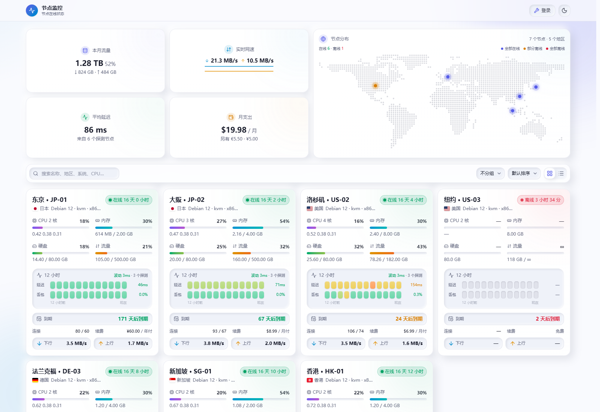

# openlat

> 12 小时延迟 / 丢包热力色块 · 微拟物玻璃质感 · 卡片 / 列表双视图 · monitor 状态面板主题



openlat 是 [monitor](https://github.com/monitor-probe/monitor) 的第三方主题，基于 [monitor-theme-default](https://github.com/monitor-probe/monitor-theme-default) 改造。

柔和双向阴影与高斯模糊背景，纯白（深色为墨蓝）卡片，12 小时延迟 / 丢包热力色块，冷暖色调贯穿全站，深浅色随系统自动切换。

## 特性

### 节点卡片

- 12 小时延迟 / 丢包分轨显示：所有探测线路按小时求均值后，延迟与丢包各一条独立轨道，每小时一格圆角热力方块，五档低饱和色阶（延迟 <60ms 绿 / <110ms 草绿 / <180ms 黄 / <280ms 橙 / ≥280ms 红，丢包 <0.5% / <2% / <5% / <10% / ≥10%）
- 色块带顶部高光与底部浅投影，嵌在凹陷轨道里，延续整体的微拟物语言；没有数据的格子凹陷留白，每条轨道右侧直接标注平均值
- 逐格悬停可看该小时的延迟或丢包与探测数
- 没有探测数据的节点同样铺满 12 格空槽，卡片行高与有数据的节点完全一致；顶部一行汇总波动与探测数量
- 到期栏为微拟物凹陷轨道，**轨道底色与「到期」标签、日历图标都保持固定颜色**，只用「XX 天后到期」这行数值的文字颜色区分：>30 天或永不到期中性 / 绿色、≤30 天琥珀、≤7 天或已过期红色
- 上下行速率并排两条中性凹陷轨道，靠**箭头颜色**（下行蓝 / 上行琥珀）区分方向，轨道本身不填色，避免整条色块喧宾夺主
- 连接与续费两列紧凑排布
- CPU / 内存 / 硬盘 / 流量进度条，附负载与真实用量小字
- 状态柔光、国家标签、备注摘要，坏数据自动隔离不影响整页

### 主面板

- 四张概览卡：本月流量（全站上下行合计，有额度时附已用百分比）/ 实时网速 / 平均延迟 / 月支出（按账单周期折算，多币种分列）
- 世界地图卡片：点阵世界地图按国家坐标标记节点位置，亮点按在线状态着色——全部在线为主题色、部分离线橙色、全部离线红色，并附图例与在线 / 离线计数；悬停看名称，点击展开地区节点列表，点击弹层外或按 Esc 关闭
- 搜索框、分组 / 排序下拉与视图切换统一为微拟物凹陷轨道风格，搜索框居左、控件收纳右侧，中间留白
- 卡片与列表双视图，支持国家 / 状态 / 系统分组与六种排序
- 列表视图：名称与各指标列横向均匀铺开；延迟列直接复用卡片视图的 **12 小时双轨**（同一个 `HeatTrack` 组件、同一份多探测聚合数据，仅尺寸更紧凑），下方并排显示当前延迟与平均丢包，两个视图的呈现完全一致
- 顶栏「进入后台 / 登录」与主题切换为两个相互独立的按钮，同样使用微拟物凹陷轨道样式，带按压缩回反馈
- WebSocket 实时推送，断线自动轮询与重连

### 详情页

顶部「返回」按钮是凹陷轨道按钮；节点名称 / 地区 / 状态 / Agent 沿用原有的胶囊样式，不再额外套一层轨道（避免环中环）。正文自上而下：四张指标卡 → 资源与延迟图表 → 硬件配置等信息卡片 → 备注。

- 四张指标卡：CPU 使用率 / 内存·硬盘 / TCP·UDP / 当前延迟
- 资源 Tab：CPU / 内存 / 网络速率 / 磁盘历史曲线
- 网络延迟 Tab：多探测曲线，平滑与削峰可切换，断点顺滑连线，可仅看单个探测
- 多节点延迟列表：当前 / 平均 / 波动 / 丢包，一键仅看
- 信息卡片：硬件配置、运行状态、网络与流量、费用与到期，含系统、CPU、内存、硬盘、流量、费用、到期、Agent、主机名与 IP

## 快速开始

```bash
npm install
npm run dev
```

构建主题包：

```bash
npm run build
tar -czf theme.tar.gz dist theme.json preview.png
```

将 `theme.tar.gz` 上传到 monitor 后台即可安装。

## 主题契约

| 接口 | 说明 |
| --- | --- |
| `GET /api/me` | 站点名、登录状态、公开页开关 |
| `GET /api/nodes` | 节点列表、实时指标与累计流量 |
| `GET /api/nodes/{id}/metrics` | 历史指标与延迟记录（`series=metrics\|ping`） |
| `GET /api/ws` | 节点快照推送 |

详情页路由：`/node/{id}`

## 技术栈

React 19 · Vite · Tailwind CSS 4 · Recharts · lucide-react

## 发布

源码仓库：<https://github.com/bluesmkun/openlat>

推送 `v*` 标签后由 GitHub Actions 自动构建，并发布 `theme.tar.gz` 与 `theme.tar.gz.sha256`；面板可从 Release 一键更新。

手动打包与发版：

```bash
npm run build
tar -czf theme.tar.gz dist theme.json preview.png
shasum -a 256 theme.tar.gz | cut -d' ' -f1 > theme.tar.gz.sha256
```

`theme.tar.gz` 与校验文件只作为 Release 资产，不提交进仓库。
